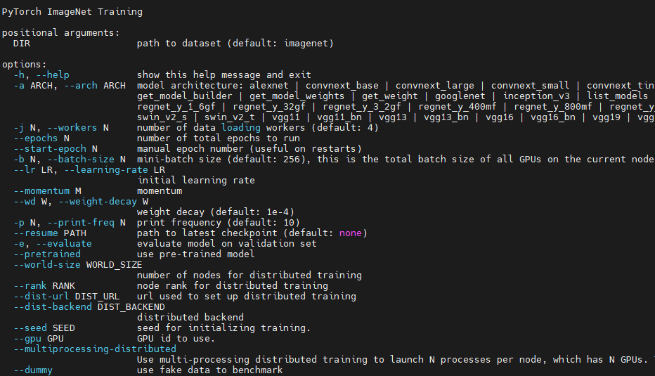

### 训练脚本:

    python main.py [-h] [--arch ARCH] [--workers N] [--epochs N] [--start-epoch N] [--batch-size N] [--learning-rate LR] [--momentum M] [--weight-decay W] [--print-freq N] [--resume PATH] [--evaluate] [--pretrained] [--world-size WORLD_SIZE] [--rank RANK] [--dist-url DIST_URL] [--dist-backend DIST_BACKEND] [--seed SEED] [--gpu GPU] [--multiprocessing-distributed] [--dummy] [DIR]

#### python main.py -h



### 0. 准备数据集:

```bash
cd /stores/datasets/imagenet
wget http://10.113.3.1/corex/toolbox/datasets/imagenet2012/ILSVRC2012_img_train.tar
wget http://10.113.3.1/corex/toolbox/datasets/imagenet2012/ILSVRC2012_img_val.tar
tar -xf ILSVRC2012_img_train.tar
tar -xf ILSVRC2012_img_val.tar
```

### 1. 单机单卡训练:

```bash
python main.py --arch resnet50 --epochs 1 --learning-rate 0.1 /stores/datasets/imagenet
```

### 2. 单机多卡训练:

```bash
python main.py --arch resnet50 --epochs 1 --learning-rate 0.1 --dist-url 'tcp://127.0.0.1:8888' --dist-backend 'nccl' --multiprocessing-distributed --world-size 1 --rank 0 /stores/datasets/imagenet
```

### 3. 多机多卡训练:

```bash
python main.py --arch resnet50 --epochs 1 --learning-rate 0.1 --dist-url 'tcp://10.113.1.77:8888' --dist-backend 'nccl' --multiprocessing-distributed --world-size 2 --rank 0 /stores/datasets/imagenet
python main.py --arch resnet50 --epochs 1 --learning-rate 0.1 --dist-url 'tcp://10.113.1.77:8888' --dist-backend 'nccl' --multiprocessing-distributed --world-size 2 --rank 1 /stores/datasets/imagenet
```

### NOTE:

https://github.com/pytorch/examples/blob/main/imagenet/main.py
